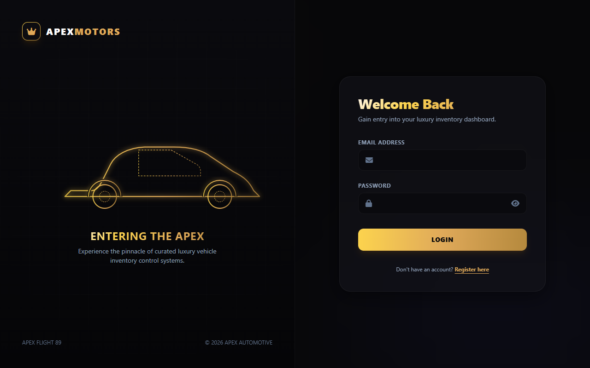
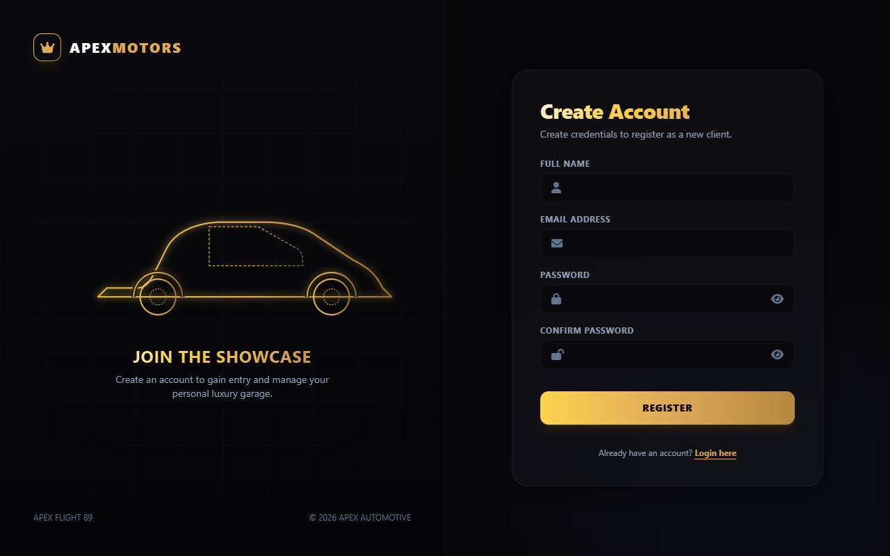
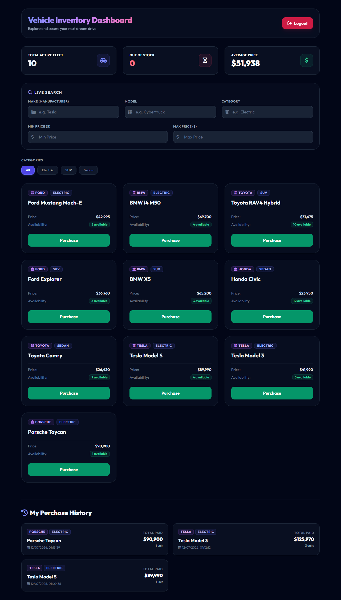
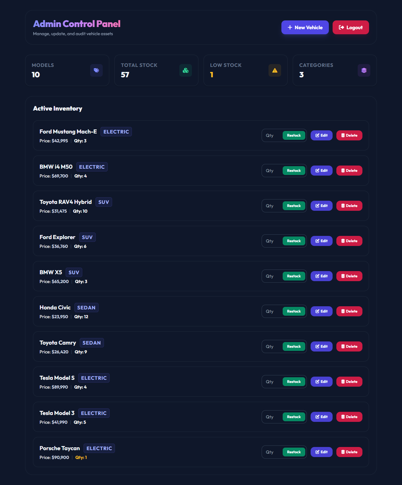

# 🚗 Car Dealership Inventory System

> **TDD Kata — Incubyte Assessment**

A full-stack Car Dealership Inventory System built with **Test-Driven Development (TDD)**, following the Red-Green-Refactor pattern.

---

## Tech Stack

| Layer | Technology |
|---|---|
| Backend | Java 17 + Spring Boot 3 |
| Database | PostgreSQL |
| Auth | JWT (jjwt) |
| Frontend | React 18 + Vite |
| Testing | JUnit 5 + Mockito + MockMvc |
| Coverage | JaCoCo |

---

## 🌐 Deployed Live Demo (Optional - Brownie Points)

* **Frontend Showroom (Vercel)**: [https://car-dealership-inventory-system-x9j.vercel.app](https://car-dealership-inventory-system-x9j.vercel.app)
* **Backend API (AWS Elastic Beanstalk - Proxied)**: [https://car-dealership-inventory-system-x9j.vercel.app/api](https://car-dealership-inventory-system-x9j.vercel.app/api)

---

## 📸 Application Screenshots

### 🔑 1. User Authentication (Login & Registration)
Custom split-screen login and registration pages featuring gold accents, responsive inputs, and form validations.



### 🏎️ 2. Car List (Customer Showroom)
Interactive dynamic showroom catalog showing all available vehicles, prices, and stock indicators.


### 📊 3. Purchase History
User transaction ledger displaying purchased vehicles, purchase dates, and quantities.


### 🛠️ 4. Admin Dashboard
The main administrative dashboard showing overall stats and action lists.


### ➕ 5. Add & Manage Vehicles
Interactive administrative controls for adding new vehicles, editing details, deleting entries, and restocking.


---

## Project Status

🟢 **Completed & Deployed** — All user stories and technical constraints fully satisfied.


## Test Cases & TDD Coverage

This project has been fully developed using **Test-Driven Development (TDD)**. All requirements outlined in the assessment have been validated through our automated test suites.

### ⚙️ Backend Tests (`JUnit 5` + `Mockito` + `MockMvc`)
Our backend suite contains **56 test cases** covering repository operations, service layers, and web API controller rules:

* **Authentication & JWT (`AuthServiceTest`, `JwtServiceTest`)**
  * `register_shouldSaveUserAndReturnToken_whenRequestIsValid`: Happy path registration.
  * `register_shouldThrowIllegalArgumentException_whenEmailIsAlreadyTaken`: Handles duplicate registrations.
  * `login_shouldReturnJwtToken_whenCredentialsAreValid`: Verification of credentials.
  * `login_shouldThrowIllegalArgumentException_whenPasswordIsWrong`: Prevents invalid login access.
  * JWT generation, parsing, validation, and token signing tests.
* **User Management (`UserServiceTest`, `UserControllerTest`)**
  * `getAllUsers_shouldReturn200AndList_whenAdmin`: Admin retrieval of users.
  * `getAllUsers_shouldReturn403_whenNotAdmin`: REST authorization guard.
  * `deleteUser_shouldReturn204NoContent_whenAdmin`: Admin user deletion.
  * `deleteUser_shouldReturn403Forbidden_whenNotAdmin`: Delete protection constraint.
  * Profile endpoint retrieval for authenticated users (`GET /api/users/me`).
* **Vehicle Inventory (`VehicleServiceTest`, `VehicleControllerTest`, `VehicleRepositoryTest`)**
  * Adding a vehicle adds it to the repository and updates details (restricted to Admin role).
  * Updating a vehicle allows modification of manufacturer, model, price, and category (restricted to Admin role).
  * Deleting a vehicle removes it from the active database (restricted to Admin role).
  * Searching for vehicles dynamically filters by combinations of make, model, category, minimum price, and maximum price.
* **Purchase & Restocking Operations**
  * Purchasing a vehicle reduces the database inventory quantity.
  * Purchasing throws an exception if the purchase quantity exceeds the current stock.
  * Restocking a vehicle increases stock (restricted to Admin role).
* **Startup Database Seeding (`AdminUserSeederTest`)**
  * Verifies default system administrator account is seeded on application startup.

### 💻 Frontend Tests (`Vitest` + `React Testing Library`)
Our frontend suite contains **15 test cases** testing UI routing, event handlers, API hooks, and local storage:

* **User Authentication (`Login.test.jsx`, `Register.test.jsx`)**
  * Renders email, password, and registration inputs properly.
  * Submitting login calls `/auth/login`, saves JWT to `localStorage`, and redirects.
  * Submitting register validation checks password mismatches and registers.
* **Vehicles Dashboard (`Dashboard.test.jsx`)**
  * Renders the list of active vehicles fetched from the backend.
  * Submitting the search query filters the vehicle list display.
  * Clicking **Purchase** triggers a `POST` API call and immediately refreshes the inventory display.
  * Clicking **Logout** clears localStorage state and redirects to `/login`.
* **Admin Control Panel (`AdminDashboard.test.jsx`)**
  * Renders CRUD forms (manufacturer, model, price, category, qty) and lists active vehicles.
  * Submitting new vehicle details issues a `POST` request and clears the inputs.
  * Clicking **Delete** on a vehicle card triggers a `DELETE` API request and updates the view.
  * Entering restocking quantity and clicking **Restock** calls the restocking API.
  * Clicking **Edit** populates form fields, changes button text, and submits a `PUT` API request.
* **System Routing (`App.test.jsx`)**
  * Redirects unauthenticated users to `/login` from any route.
  * Restricts `/admin` dashboard to authenticated users with the `ADMIN` role.

---

## Setup Instructions

### Prerequisites
- **Java 17+** (JDK 17 or JDK 21 installed)
- **Maven 3.8+**
- **Node.js 18+** & **npm** (for the frontend application)
- **PostgreSQL 14+** (configured database for production/development profile)

---

### Backend Setup & Execution

1. Navigate to the backend directory:
   ```bash
   cd backend
   ```
2. Configure database credentials inside `src/main/resources/application.properties` (specifically `spring.datasource.username` and `spring.datasource.password`).
3. Build the application and compile dependencies:
   ```bash
   mvn clean compile
   ```
4. Run the automated test suite (uses H2 in-memory DB by default):
   ```bash
   mvn test
   ```
5. Start the Spring Boot backend server (runs on port `8080`):
   ```bash
   mvn spring-boot:run
   ```

---

### Frontend Setup & Execution

1. Navigate to the frontend directory:
   ```bash
   cd frontend
   ```
2. Install dependency packages:
   ```bash
   npm install
   ```
3. Run the Vitest unit/integration test suite:
   ```bash
   npm run test
   ```
4. Launch the local React development server:
   ```bash
   npm run dev
   ```
   Open [http://localhost:5173](http://localhost:5173) in your browser to view the application.

---

## My AI Usage

This project was built in pairing collaboration with **Antigravity (Google DeepMind)**, an AI coding assistant. 

### Tools Used
* **Antigravity (Google DeepMind)**: Served as the primary pairing partner for code design, refactoring, TDD test writing, and bug hunting.

### AI Assistance Log
1. **TDD RED-GREEN-REFACTOR Cycle**: Assisted in writing failing JUnit/Mockito tests in the backend and Vitest/Testing-Library tests in the frontend, followed by implementation to make them pass.
2. **Backend Services & API Controllers**: Co-authored Spring Security rules, Jwt filters, User and Vehicle REST controllers, and automated seeder scripts.
3. **Frontend Component Development**: Built the dashboard pages, search filters, stateful restocking inputs, edit/update modals, and routing guard components.
4. **Build & Test Automation**: Provided command line instructions, executed build verification steps, and investigated surefire reports and DOM dumps to fix bugs.

### Reflection
The AI pairing model significantly increased development velocity by handling repetitive boilerplate, generating mock test scenarios, and ensuring that SOLID principles were adhered to throughout refactoring phases. The structured TDD cycle worked seamlessly with automated test suggestions.

---

## Git Commit Convention

This project follows **Conventional Commits** with a TDD pattern:

```
test:     Writing a failing test (🔴 RED)
feat:     Implementing the feature (🟢 GREEN)
refactor: Cleaning up code (🔵 REFACTOR)
chore:    Setup, config, dependencies
style:    CSS, formatting
docs:     Documentation
```

Every AI-assisted commit includes:
```
Co-authored-by: Antigravity (Google DeepMind) <AI@users.noreply.github.com>
```
